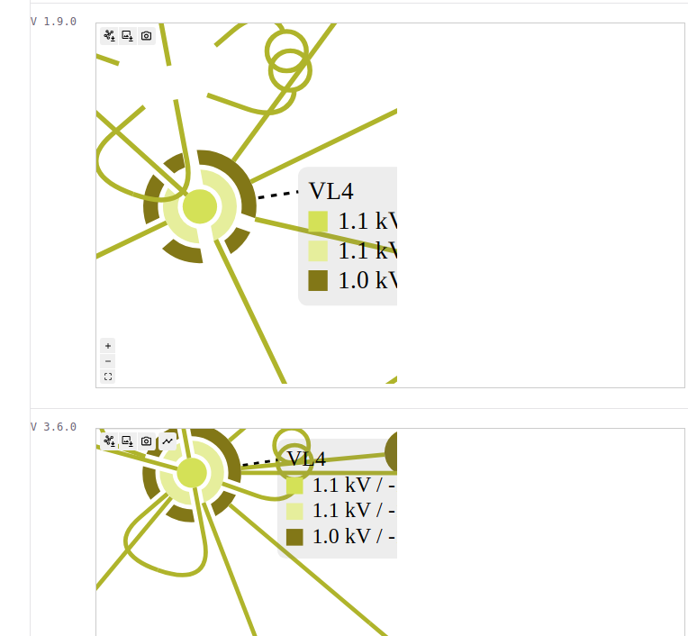

```markdown
npm create vite@latest test -- --template vanilla-ts
npm install @powsybl/network-viewer // v1.9.0 with --legacy-peer-deps
npm install @powsybl/network-viewer-core // v3.6.0 --legacy-peer-deps
```

